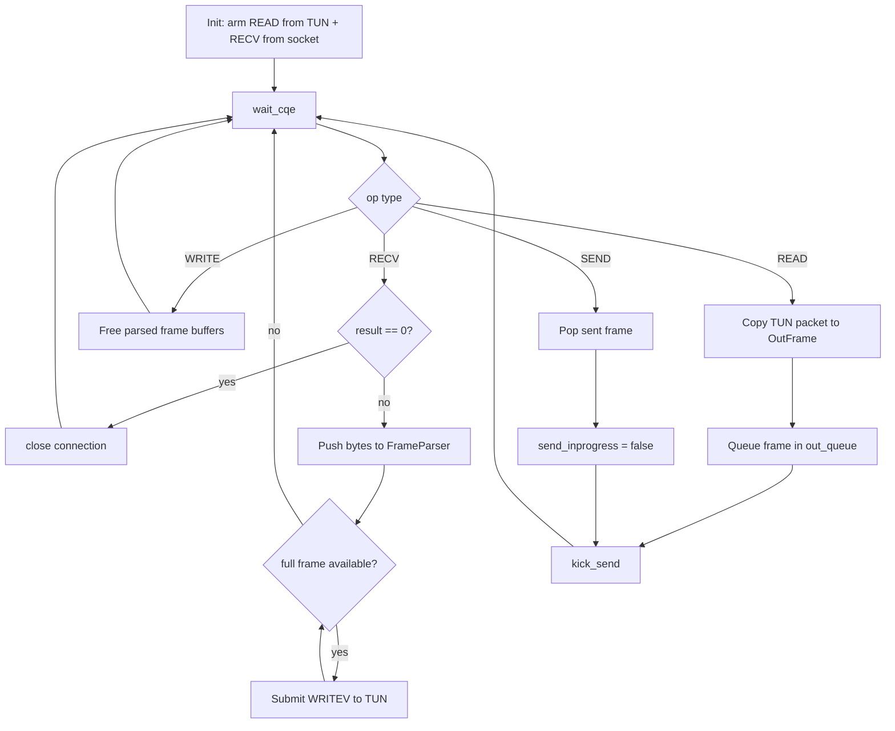
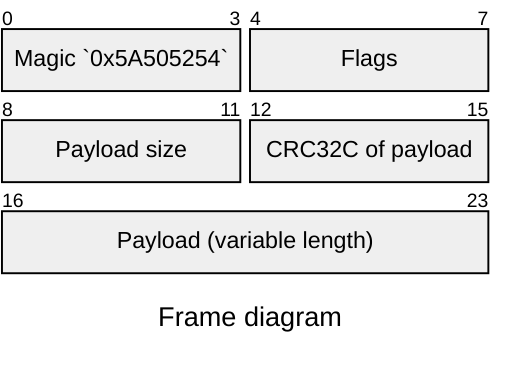

# **ZPortal** - IP tunnel over TCP

[](https://github.com/sweet-bbq-sauce/zportal/actions/workflows/ci.yml)
[](https://github.com/sweet-bbq-sauce/zportal/actions/workflows/release.yml)

Educational project exploring Linux TUN interfaces and io_uring-based
transport of IP packets over a TCP stream.

Not a VPN. No encryption. No authentication.
Intended for local labs and learning purposes only.

Linux only (`/dev/net/tun`, `ip`, `io_uring`).

## Why TCP

ZPortal tunnels IP packets over a single **TCP** stream on purpose.
This makes it easier to run through proxy layers and existing infra:

- direct TCP peer-to-peer
- SOCKS5 proxy chain (`-p` repeated)
- Tor SOCKS endpoint (for example `127.0.0.1:9050`)

The goal is transport compatibility and predictable behavior across
heterogeneous networks, not raw throughput.

## Backpressure

Backpressure is currently implicit and mostly comes from TCP + serialized TX:

- at most one `SEND` is in-flight (`send_inprogress` gate)
- next frame is sent only after CQE completion of previous send
- if network/proxy path slows down, `out_queue` grows and sender pace drops

Current limitation: `out_queue` has no hard cap, so in long congestion periods
memory can grow. If you want strict bounds, add queue limits + packet drop
policy (or temporary read throttling from TUN).

## Event Loop Logic

Main tunnel loop is completion-driven (CQE from `io_uring`):





Practical summary:

- `READ` pulls packet from TUN, wraps it into frame, enqueues for TCP send.
- `RECV` pulls TCP bytes, parser reconstructs full frame(s), then writes packet(s) to TUN.
- `SEND` and `WRITE` are completion acknowledgements used to advance queues and free buffers.
- TX is serialized by `send_inprogress`, so only one send is active at a time.

## Usage

```bash
zportald -n <ifname> -m <MTU> -a <inner CIDR> (-b <bind addr> | -c <connect addr>) [-p <proxy>]...
```

- `-n <ifname>` - TUN device name. For example `tun0`, `tun%d`.
- `-m <MTU>` - Device MTU. Range 68-65535.
- `-a <inner CIDR>` - Tunnel interface CIDR, IPv4 or IPv6. For example: `10.0.0.1/24`, `fd00::1/64`.
- `-b <bind address>` - Server mode (listen and accept one TCP peer).
- `-c <connect address>` - Client mode (connect to remote peer).
- `-p <proxy>` - Optional SOCKS5 hop in client mode. Can be passed many times to build a chain.
- `-h` - Print help.
- `-v` - Print version.

Exactly one of `-b` or `-c` must be set.

### Address format (`-b`, `-c`, `-p`)

- IPv4: `192.168.1.10:7000`
- IPv6: `[2001:db8::1]:7000`
- Hostname: `example.com:7000`
- Unix socket path: `unix:/tmp/zportal.sock`
- Abstract Unix socket: `unixa:zportal`

`-p` currently expects SOCKS5 proxy semantics.

### Examples

Server:

```bash
sudo zportald -n tun0 -m 1400 -a 10.10.0.1/24 -b 0.0.0.0:7000
```

Client:

```bash
sudo zportald -n tun0 -m 1400 -a 10.10.0.2/24 -c 203.0.113.10:7000
```

Client with SOCKS5 chain:

```bash
sudo zportald -n tun0 -m 1400 -a 10.10.0.2/24 \
  -c 203.0.113.10:7000 \
  -p proxy1.example:1080 \
  -p proxy2.example:1080
```

Client through Tor SOCKS (example):

```bash
sudo zportald -n tun0 -m 1400 -a 10.10.0.2/24 \
  -c 203.0.113.10:7000 \
  -p 127.0.0.1:9050
```

## Building and installation

### Dependencies

- `liburing-dev`
  
### Build

- `sudo apt update`
- `sudo apt install -y cmake ninja-build g++ liburing-dev iproute2`
- `mkdir build && cd build`
- `cmake .. -G Ninja`
- `ninja`
- `ctest` (optional)

If tests are not needed:

- `cmake .. -G Ninja -DBUILD_TESTS=OFF`
